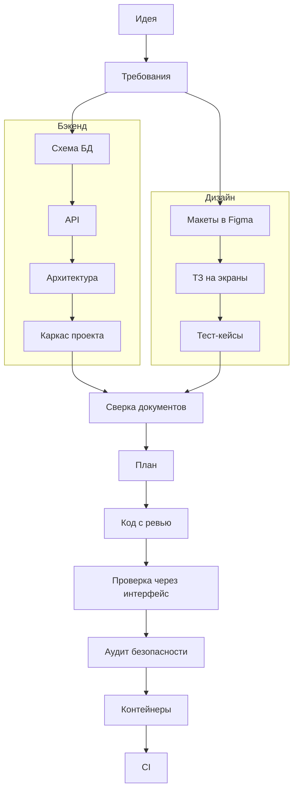

# dev-pipeline — от идеи до работающего сервиса вместе с Claude

> Плагин для Claude Code, который проводит веб-сервис через все этапы разработки: требования, схема
> данных, API, архитектура, макеты в Figma, ТЗ на экраны, тест-кейсы, план, код с ревью, проверка через
> интерфейс, контейнеры и CI. Вы принимаете решения — Claude делает работу и спрашивает на каждом шаге.

Версия плагина: **1.2.82**

---

## Что получится в итоге

- **Комплект документации** — понятный и связанный: требования (SRS), схема базы данных, контракт API,
  архитектура, макеты в Figma, ТЗ на каждый экран, пользовательские тест-кейсы. Всё на русском.
- **Работающий код** — бэкенд и фронтенд, каждый кусок прошёл ревью перед коммитом.
- **Проверка через интерфейс** — Playwright-тесты по тест-кейсам, прогнанные на запущенном приложении.
- **Контейнеры и CI** — docker-compose для тестов, разработки и продакшена; для эксплуатации — папка
  выпуска `release/<версия>/` с архивом образов и инструкцией `DEPLOY.md`; проверки на каждый push в GitHub.

Документация складывается в одну понятную структуру:

```text
documentation/
├── requirements/      требования: бизнес-требования, SRS (оглавление srs.md и файл на группу требований), пожелания к интерфейсу
├── db/                схема базы данных и миграции
├── api/               контракт API: корень openapi.yaml, операции и схемы — по файлу на каждую
├── architecture/      архитектура: основа, доменная модель, сценарии по областям
├── ui/                реестр макетов, ТЗ на экраны (файл на экран), тест-кейсы (файл на раздел)
├── project-map/       карта проекта: где какой документ и где код
├── deploy/            инструкция для эксплуатации (deploy.md)
└── plans/<версия>/    план, прогресс работы, отчёты проверок, итог версии — рабочие файлы, в git не попадают
```

Большие документы разложены по файлам, чтобы и человек, и агент открывали только нужную часть, а не
тысячи строк: у SRS, OpenAPI и тест-кейсов есть оглавление, и номера требований, операций и кейсов
сквозные по всему документу. Карта всего этого — `documentation/project-map/project-map.md`, а ссылка на
неё стоит в `CLAUDE.md` проекта: Claude читает этот файл в начале каждой сессии и сразу знает, где что
искать.

---

## Что нужно подготовить

### 1. Figma — для макетов

Плагин рисует макеты экранов прямо в Figma, а потом пишет по ним ТЗ для фронтенда.

- **Аккаунт Figma с полным доступом (Full) на платном тарифе** (Professional, Organization или Enterprise).
  В платной команде Figma у каждого участника свой тип доступа: Full, Dev, Collab или View (в настройках
  Figma он называется seat). Рисовать макеты через плагин можно только с доступом Full. С Dev макеты можно
  только читать — этого хватит для ТЗ и проверки экранов, но не для рисования. С Collab и View плагин
  сможет обратиться к Figma всего несколько раз в месяц — пайплайн так не пройти. Свой тип доступа можно
  узнать у администратора команды в Figma или после подключения — см. шаг 7 в
  [Как подключить Figma](#как-подключить-figma).
- **Файл в Figma, куда будут рисоваться макеты.** Подойдёт пустой. У вас должны быть права на
  **редактирование** этого файла. Ссылку на файл вы дадите, когда плагин спросит.
- Если в файле уже есть макеты дизайнера, плагин может работать с ними: разметит экраны и не будет
  перерисовывать.

Если у сервиса нет интерфейса (только API), Figma не нужна — дизайн-этапы пропускаются.

### 2. MCP-серверы

MCP-сервер — это «подключение» Claude к внешнему сервису. Плагин приносит два сервера с собой,
отдельно их ставить не нужно:

| Сервер | Зачем | Что сделать |
|---|---|---|
| **Figma** | рисовать макеты, читать их для ТЗ и для проверки экранов | один раз войти в аккаунт — см. [Как подключить Figma](#как-подключить-figma) |
| **Context7** | брать актуальную документацию библиотек, когда пишется код | ничего, работает сразу |

Без входа в Figma этапы с макетами остановятся и попросят подключить Figma.

#### Как подключить Figma

Делается один раз, после [установки плагина](#установка).

1. **Войдите в нужный аккаунт Figma в браузере** (figma.com). Подключится тот аккаунт, который сейчас открыт
   в браузере, — если у вас их несколько, сначала выйдите из лишнего.
2. **Откройте Claude Code** в терминале в любой папке:

   ```bash
   claude
   ```

3. **Выполните в чате команду** `/mcp`:

   ```text
   /mcp
   ```

   Откроется список подключений. Сервер Figma из плагина называется `plugin:dev-pipeline:figma` и
   помечен как требующий входа (`needs authentication`).
4. **Выберите его стрелками, нажмите Enter и выберите Authenticate.** Откроется браузер со страницей Figma.
   Если браузер не открылся, Claude Code покажет ссылку — скопируйте её и откройте вручную.
5. **На странице Figma нажмите Allow access** — так вы разрешаете Claude работать с вашими файлами.
6. **Вернитесь в терминал.** Появится сообщение `Authentication successful. Connected to figma`, а в
   списке `/mcp` у сервера будет статус `connected`. Список закрывается клавишей Esc.
7. **Проверьте вход.** Напишите в чате:

   ```text
   Кто я в Figma?
   ```

   Claude ответит именем аккаунта и типом доступа. Должно быть **Full** — иначе макеты рисоваться не будут.

Вход сохраняется, повторять его при каждом запуске не нужно.

**Если что-то не так:**
- **Подключился не тот аккаунт или Figma снова просит входа** — выполните `/mcp`, выберите
  `plugin:dev-pipeline:figma` и снова выберите Authenticate, предварительно открыв в браузере нужный
  аккаунт.
- **Нет прав на файл** — попросите владельца файла дать вам права на редактирование (Can edit).
- **В списке `/mcp` нет сервера Figma** — плагин не установлен или Claude Code не перезапущен после установки.

### 3. Программы на компьютере

Нужны для схем в документах, локальной базы данных, контейнеров и тестов.

| Программа | Зачем | Когда понадобится |
|---|---|---|
| **Claude Code 2.1.293+** | с этой версии механические задачи (переименования, значения настроек, мелкие исправления по ревью) выполняет быстрая и дешёвая модель Haiku 5.5; в старых версиях вместо неё запускается Haiku 4.5, которую на коде не проверяли. Версию покажет `claude --version`; приложение Claude обновляет её само | с выполнения плана |
| **Git** | история изменений, каждый шаг — коммит | с первого этапа |
| **D2** | схемы в документах (архитектура, схема БД) | с этапа схемы БД |
| **PlantUML** | диаграммы последовательности для сложных сценариев | на этапе архитектуры |
| **Docker** (Docker Desktop или Docker Engine) | локальная база данных, контейнеры, сборка образов | с каркаса проекта |
| **Node.js 22+** (или Python + uv) | сам сервис; Node.js нужен и для тестов через браузер | с каркаса проекта |
| **Python 3** | подбор визуального направления: поиск по базе стилей, палитр и шрифтов | на этапе макетов |
| **Браузер для тестов** (Chromium от Playwright) | проверка готового приложения через интерфейс | на этапе UI-приёмки |
| **GitHub-аккаунт** | только для этапа CI | в конце |

### 4. Установка по шагам

Ставьте по порядку. Каждая команда — отдельно: скопировать, вставить в терминал, дождаться окончания.

#### macOS

**1. Homebrew** — менеджер программ для macOS. Если уже стоит (`brew --version` печатает версию), пропустите.

```bash
/bin/bash -c "$(curl -fsSL https://raw.githubusercontent.com/Homebrew/install/HEAD/install.sh)"
```

В конце установщик покажет две-три команды «Next steps» — выполните их, чтобы `brew` стал доступен.

**2. Git, D2, PlantUML, Node.js, Python 3:**

```bash
brew install git d2 plantuml node python
```

**3. Docker Desktop:**

```bash
brew install --cask docker
```

Откройте Docker Desktop из «Программ» один раз и дождитесь, пока он запустится (значок кита в строке меню).

**4. Python и uv** — только если сервис будет на Python:

```bash
brew install uv
```

**5. Браузер для тестов через интерфейс:**

```bash
npx playwright install chromium
```

#### Linux (Ubuntu, Debian)

Через `apt` ставятся только Git, curl и PlantUML: D2 в стандартных репозиториях нет, а Docker и Node.js там
устаревших версий, поэтому для них — официальные способы установки.

**1. Git, curl, PlantUML, Python 3:**

```bash
sudo apt update && sudo apt install -y git curl plantuml python3
```

**2. D2:**

```bash
curl -fsSL https://d2lang.com/install.sh | sh -s --
```

**3. Docker Engine** (вместе с ним ставится buildx для сборки образов):

```bash
curl -fsSL https://get.docker.com | sh
```

Чтобы запускать Docker без `sudo`, добавьте себя в группу `docker`:

```bash
sudo usermod -aG docker $USER
```

Затем выйдите из системы и войдите снова (или перезагрузитесь), чтобы это вступило в силу.

**4. Node.js 22** — через nvm:

```bash
curl -o- https://raw.githubusercontent.com/nvm-sh/nvm/v0.40.8/install.sh | bash
```

Откройте новое окно терминала и поставьте Node.js:

```bash
nvm install 22
```

**5. Python и uv** — только если сервис будет на Python:

```bash
curl -LsSf https://astral.sh/uv/install.sh | sh
```

**6. Браузер для тестов через интерфейс** (вместе с системными библиотеками, которые ему нужны):

```bash
npx playwright install --with-deps chromium
```

На Fedora и Arch вместо шага 1 — `sudo dnf install git curl plantuml` или `sudo pacman -S git curl plantuml`;
остальные шаги те же.

#### Windows (через WSL 2)

Плагин работает в Linux-окружении внутри Windows — WSL 2 с Ubuntu. Все программы ставятся в Ubuntu,
а Docker — как Docker Desktop для Windows, который отдаёт Docker в Ubuntu.

Нужна Windows 11 или Windows 10 версии 2004 и новее (узнать: Win+R → `winver`). В BIOS/UEFI должна быть
включена виртуализация (Intel VT-x или AMD-V) — на большинстве компьютеров она включена; проверить:
Диспетчер задач → Производительность → ЦП → «Виртуализация: Включено».

**1. WSL 2 и Ubuntu.** Откройте PowerShell от имени администратора (Пуск → PowerShell → правой кнопкой →
«Запуск от имени администратора») и выполните:

```powershell
wsl --install
```

Перезагрузите компьютер. После перезагрузки откроется окно Ubuntu (если не открылось — найдите Ubuntu в
меню Пуск). Придумайте имя пользователя и пароль для Linux: они не связаны с учётной записью Windows,
пароль понадобится для команд с `sudo`.

Если WSL уже стоял, обновите его и проверьте, что Ubuntu работает на версии 2:

```powershell
wsl --update
```

```powershell
wsl -l -v
```

В колонке VERSION должно быть `2`. Если там `1`:

```powershell
wsl --set-version Ubuntu 2
```

**2. Docker Desktop для Windows** — ставится в Windows, не в Ubuntu. Скачайте
[Docker Desktop](https://docs.docker.com/desktop/setup/install/windows-install/) или в PowerShell:

```powershell
winget install -e --id Docker.DockerDesktop
```

Запустите Docker Desktop и в его настройках проверьте:
- Settings → General → включено «Use the WSL 2 based engine»;
- Settings → Resources → WSL integration → включён переключатель напротив Ubuntu → Apply & restart.

Docker Desktop должен быть запущен, когда плагин собирает образы или поднимает контейнеры.

Дальше всё — в окне Ubuntu (Пуск → Ubuntu, или вкладка Ubuntu в Windows Terminal).

**3. Git, curl, PlantUML, Python 3:**

```bash
sudo apt update && sudo apt install -y git curl plantuml python3
```

**4. D2:**

```bash
curl -fsSL https://d2lang.com/install.sh | sh -s --
```

**5. Node.js 22** — через nvm:

```bash
curl -o- https://raw.githubusercontent.com/nvm-sh/nvm/v0.40.8/install.sh | bash
```

Закройте и снова откройте окно Ubuntu и поставьте Node.js:

```bash
nvm install 22
```

Проверьте, что используется Node.js из Ubuntu, а не из Windows — путь должен начинаться с `/home/`:

```bash
which node
```

**6. Python и uv** — только если сервис будет на Python:

```bash
curl -LsSf https://astral.sh/uv/install.sh | sh
```

**7. Браузер для тестов через интерфейс** (вместе с системными библиотеками, которые ему нужны):

```bash
npx playwright install --with-deps chromium
```

**8. Папка для проектов.** Держите проекты внутри Ubuntu, а не на диске `C:` (`/mnt/c/...`): там работа с
файлами в разы медленнее, и сборка с тестами заметно тормозит.

```bash
mkdir -p ~/projects && cd ~/projects
```

Открыть эту папку в Проводнике Windows можно командой `explorer.exe .`, а в VS Code (с расширением WSL) —
`code .`.

#### Проверка

На Windows — в окне Ubuntu. Каждая команда должна напечатать номер версии:

```bash
git --version
```

```bash
d2 --version
```

```bash
plantuml -version
```

```bash
docker --version
```

```bash
docker buildx version
```

```bash
node --version
```

```bash
python3 --version
```

Если какая-то пишет «command not found» — эта программа не поставилась или терминал нужно открыть заново.

Если D2 или PlantUML не установлены, документы всё равно пишутся, но вместо картинки схемы останется
только её исходный текст — плагин об этом скажет. PlantUML можно заменить Docker'ом: плагин сам
запустит его в контейнере.

---

## Установка

В Claude Code (в чате) выполните две команды:

```text
/plugin marketplace add Idontlikedrinkpivo/web-dev-pipeline-claude-plugin
```

```text
/plugin install dev-pipeline@dev-pipeline-marketplace
```

Или то же самое в терминале:

```bash
claude plugin marketplace add Idontlikedrinkpivo/web-dev-pipeline-claude-plugin
```

```bash
claude plugin install dev-pipeline@dev-pipeline-marketplace
```

Затем:

1. **Перезапустите Claude Code** — так он увидит скиллы и агентов плагина.
2. **Подключите Figma** — по шагам в разделе [Как подключить Figma](#как-подключить-figma).
3. **Проверьте:** откройте любую папку и напишите `/dev-pipeline:pipeline где я`. Плагин ответит, на каком
   этапе проект (в пустой папке — «в начале»).

### Обновление до новой версии

Номер последней версии указан в начале этого README («Версия плагина»). Сами по себе обновления не
приходят — их нужно скачать.

Команды ниже вводятся не в чат Claude, а в обычный терминал: на macOS — программа «Терминал»
(Программы → Утилиты), на Linux — любой терминал, на Windows — окно Ubuntu. Каждую команду вставьте,
нажмите Enter и дождитесь окончания.

1. **Узнайте, какая версия стоит у вас** — строка `Version`:

   ```bash
   claude plugin list
   ```

2. **Обновите список версий из этого репозитория:**

   ```bash
   claude plugin marketplace update dev-pipeline-marketplace
   ```

3. **Обновите плагин:**

   ```bash
   claude plugin update dev-pipeline@dev-pipeline-marketplace
   ```

4. **Перезапустите Claude Code** — закройте и снова откройте приложение Claude или выйдите из `claude` в
   терминале и запустите его заново. Уже открытые сессии продолжают работать на старой версии.
5. **Проверьте:** `claude plugin list` показывает новую версию.

Документы и код ваших проектов при обновлении не меняются, вход в Figma сохраняется. Если проект был
на середине этапа, напишите `/dev-pipeline:pipeline где я` — плагин найдёт, где вы остановились, и
продолжит уже по правилам новой версии.

---

## Быстрый старт: первый проект

1. Создайте пустую папку для проекта и откройте её в Claude Code.
2. Опишите идею. Подходит любой формат — пара абзацев, заметка, тикет, письмо заказчика:

   ```text
   /dev-pipeline:brainstorm Хочу сервис бронирования переговорных для коворкинга.
   Резиденты бронируют комнату на время, администратор закрывает комнату на обслуживание.
   ```

   Если требования уже понятны и записаны, начните сразу с SRS:

   ```text
   /dev-pipeline:srs-writer <ваше описание или путь к файлу с ним>
   ```

3. Отвечайте на вопросы. Claude задаёт их по одному и предлагает варианты с рекомендацией. Ответ — обычное
   сообщение: буква варианта или свой текст.
4. После каждого этапа Claude показывает результат и спрашивает, что дальше: **запустить** следующий этап,
   **пропустить** проверку или **остановиться**. Можно остановиться в любой момент и вернуться позже.
5. В новой сессии напишите `/dev-pipeline:pipeline где я` — плагин по файлам на диске поймёт, где вы
   остановились, и предложит следующий шаг.

---

## Как устроен процесс

После требований работа идёт двумя параллельными ветками — бэкенд и дизайн — и они встречаются перед
планом:



| Этап | Скилл | Что происходит | Проверка после этапа | Что делаете вы | Что появляется |
|---|---|---|---|---|---|
| Идея | `brainstorm` | разбираем идею: цель, пользователи, границы | допрос `grill-me` | отвечаете на вопросы | бизнес-требования |
| Требования | `srs-writer` | пишет SRS: требования, сценарии, правила, критерии приёмки | допрос `grill-me` → ревью `doc-review` | отвечаете, принимаете | `requirements/srs/`: `srs.md` и файлы групп |
| Схема БД | `db-schema-design` | проектирует таблицы и первую миграцию | ревью `doc-review` | смотрите, задаёте вопросы | `db/schema.md`, `db/migrations/` |
| API | `openapi-spec-generator` | описывает контракт API | ревью `doc-review` | — | `api/openapi.yaml` и файлы операций и схем |
| Архитектура | `clean-architecture-design` | основа, доменная модель, сценарии; предлагает стек | ревью `doc-review` каждого документа | выбираете стек из вариантов | `architecture/` |
| Каркас | `repo-scaffold` | создаёт пустой запускаемый проект по архитектуре | — | — | код каркаса, карта проекта |
| Макеты | `ui-design` | предлагает 2–3 визуальных направления образцами в Figma, рисует экраны по требованиям в выбранном; умеет перекрасить готовые макеты | — (макеты смотрите вы сами) | даёте ссылку на файл Figma, выбираете направление, смотрите макеты | макеты, `ui/frames-register.md` |
| ТЗ на экраны | `screen-spec` | ТЗ на фронтенд по каждому экрану | ревью `doc-review` | — | `ui/screen-specs/` |
| Тест-кейсы | `ui-test-cases` | пользовательские сценарии проверки, по файлу на раздел | — | — | `ui/test-cases/` |
| Сверка | `docs-consistency` | проверяет, что все документы согласованы | — (этап сам проверка) | решаете спорные места | отчёт в папке версии |
| План | `plan` | разбивает работу на небольшие задачи | ревью плана `plan-review` — идёт само | подтверждаете версию | `plans/<версия>/plan.md` |
| Код | `work` | выполняет план | ревью каждой задачи `code-review-unit`, в конце ревью всего результата `code-review-full` — запускаются сами | следите за прогрессом | код, `progress.md` |
| Проверка | `ui-test-cases` | прогоняет тест-кейсы в браузере в два прохода: весь набор, затем разбор упавших | — (этап сам проверка) | следите за прогрессом прогона | `test-run.md`: прогресс и отчёт о дефектах |
| Безопасность | `security-audit` | раз за итерацию проверяет всё приложение: сканеры зависимостей, секретов и опасных шаблонов, затем каждая операция API от маршрута до данных — права, чужие данные, ввод и вывод | — (этап сам проверка) | решаете по каждой серьёзной находке: исправить, принять риск или отложить | `security-audit.md`: матрица доступа и находки |
| Контейнеры | `deploy-topology` | docker-compose, образы и инструкция для эксплуатации; не собирает релиз при открытой критичной уязвимости и проверяет образы сканером | — | — | `release/<версия>/`: архив образов и `DEPLOY.md` |
| CI | `ci-pipeline` | проверки на каждый push в GitHub | — | — | `.github/workflows/ci.yml` |

Нет интерфейса — дизайн-ветка пропускается. Нет базы данных — пропускается схема. Плагин сам скажет, что и
почему пропущено.

### Проверки между этапами

Где какая проверка — в колонке «Проверка после этапа». Перед допросом, ревью документа и сверкой Claude
спрашивает: запустить, пропустить или остановиться. Ревью плана и ревью кода идут сами: к этому моменту все
продуктовые решения уже приняты в документах, и найденное — работа самого плагина.

- **Допрос** (`grill-me`) — Claude задаёт неудобные вопросы по требованиям, чтобы не осталось молчаливых
  допущений. На каждый вопрос отвечаете вы. Лучше не пропускать на первой версии.
- **Ревью документа** (`doc-review`) — несколько «рецензентов» с разных сторон (логика, безопасность,
  выполнимость) ищут пробелы. Плагин показывает все замечания сразу и предлагает пройти их по одному —
  решение по каждому ваше. После правок спрашивает, проверить ли ещё раз; кругов сколько понадобится.
- **Сверка комплекта** (`docs-consistency`) — все документы вместе: у каждого требования есть место в
  документах, одно и то же везде называется одинаково.
- **Ревью плана** (`plan-review`) — задачи действительно маленькие, порядок верный, каждый критерий приёмки
  чем-то покрыт. Идёт само, без вопроса; замечания к плану плагин исправляет сам, кругами до прохождения.
- **Ревью кода** (`code-review-unit`, `code-review-full`) — каждой задачи сразу после неё и всего результата
  в конце; идёт автоматически, без вопроса.

**Выполнение плана (`work`) идёт само:** ревью, исправления и повторные проверки крутятся без вопросов.
Работа останавливается и спрашивает вас только когда задача не может пройти: в документах не хватает решения,
ревью упёрлось в проект, а не в код, или круги исправлений перестали давать результат. Тогда в чате будет
сказано, что мешает, что уже пробовали и что вы можете решить. Ваше решение плагин сам вносит в документы
и коммитит, прежде чем продолжить (см. «Решение поменялось по ходу работы»).

Прогон можно оставить на ночь. Каждый шаг заканчивается тем, что следующая задача уже запущена, поэтому
работа не встанет, пока вас нет. Ждать вас она будет только с вопросом, без ответа на который дальше идти
нельзя (те самые остановки выше). Случайное или короткое сообщение («ну?», «ты тут?», опечатка) прогон не
останавливает: плагин ответит одной строкой со счётом и ссылкой на прогресс и продолжит. Вопроса
«Продолжать?» не будет; остановить можно словами «стоп», «подожди» или «остановись». Если прогон всё же
прервался (обрыв связи, сжатие контекста), любое ваше сообщение возобновит его с того места, где он
остановился.

Пропуск проверки — нормальный выбор для маленького изменения; плагин сам порекомендует, когда можно пропустить.

**Повтор до полного прохождения.** Если проверка что-то нашла, исправление и повторная проверка идут
кругами, пока проверка не пройдёт, — без заранее заданного числа кругов. Чтобы это не стоило лишнего:

- повторная проверка читает только то, что изменило последнее исправление, и ещё открытые замечания, а не
  всю работу заново (исключение — ревью документа: правка в одном разделе может противоречить другому,
  поэтому он перечитывается целиком, но уже решённые замечания не поднимаются снова);
- исправляющий получает историю — что уже пробовали, чтобы не повторять;
- более сильная модель подключается, только если замечание пережило исправление;
- круги крутятся только из-за блокирующих замечаний, мелкие уходят в отчёт.

Плагин остановится и спросит вас не после N кругов, а когда круги перестали давать результат: вернулось уже
исправленное замечание, круг ничего не закрыл, самая сильная модель не справилась — или когда нужно ваше
решение. В файле прогресса видно, как идут круги: «Круг 3: закрыто 2, осталось 1».

### Следить за работой

Пока выполняется план, плагин ведёт файл прогресса `documentation/plans/<версия>/progress.md` рядом с
планом. В нём каждая задача: что делает, какой агент её выполняет, статус и итог ревью. Строка меняется
сразу, как только меняется статус задачи.

**Как открыть:** перед первой задачей Claude выводит в чат ссылку на `progress.md` — нажмите на неё, файл
откроется в панели рядом с чатом и будет обновляться по ходу работы. Ссылка повторяется после каждой задачи,
вместе со счётом — «План: 3 из 6 · progress.md», — и при каждой остановке. Если вы закрыли файл или отошли,
откройте его из последнего сообщения, листать чат к началу не нужно.

Сразу под заголовком файла — полоса прогресса из 100 клеток (одна клетка — 1%) с процентом, а под ней —
сколько сделано из скольких («Сделано: 3 из 6»). Все задачи весят одинаково, процент округляется вниз,
поэтому 100% появится только после последней задачи. Под таблицей — состояние финального ревью и время
последнего обновления.

**Как это выглядит:**

> **Прогресс выполнения плана — итерация 1.1.0**
>
> ```text
> ██████████████████████████████████████████████████░░░░░░░░░░░░░░░░░░░░░░░░░░░░░░░░░░░░░░░░░░░░░░░░░░ 50%
> ```
>
> Сделано: 3 из 6
>
> | U | Цель | Исполнитель | Статус | Ревью |
> |---|---|---|---|---|
> | U1 | миграция: таблица отмен брони | impl-lite | ✅ закоммичен | COMMIT |
> | U2 | сущность «Бронь»: правило отмены не позже чем за час | impl-medium | ✅ закоммичен | FIX_THEN_COMMIT (текст ошибки) → исправлено |
> | U3 | сценарий «Отменить бронь» | impl-medium | ✅ закоммичен | COMMIT |
> | U4 | API: POST /bookings/{id}/cancel | impl-medium | 🔍 на ревью | — |
> | U5 | экран S-2: кнопка «Отменить» и диалог подтверждения | impl-ui | 🔄 в работе | — |
> | U6 | версия сервиса 1.1.0 | mechanical-worker | ⏳ ждёт | — |
>
> Финальное ревью: не запускалось · BASE `a1b2c3d` · обновлено 2026-10-05 14:32

Статусы: `⏳ ждёт` → `🔄 в работе` → `🔍 на ревью` → `✅ закоммичен`; `⛔ остановлен` — задача не
прошла (в документах не хватает решения или исправления не сходятся): плагин объясняет причину и спрашивает,
что делать. В колонке «Ревью» — путь задачи через
ревью: `COMMIT` — принята с первого раза, `FIX_THEN_COMMIT (…) → исправлено` — были мелкие замечания.

Если финальное ревью всего результата нашло проблемы, ниже появляется раздел «Исправления по финальному
ревью» со своим индикатором: каждое замечание — отдельной строкой со своим статусом, а в конце — итог
повторного ревью.

> **Исправления по финальному ревью**
>
> ```text
> ██████████████████████████████████████████████████░░░░░░░░░░░░░░░░░░░░░░░░░░░░░░░░░░░░░░░░░░░░░░░░░░ 50%
> ```
>
> Исправлено: 1 из 2
>
> | F | Замечание | Важность | Юнит | Исполнитель | Статус | Ревью |
> |---|---|---|---|---|---|---|
> | F1 | правило «не позже чем за час» проверяется в сценарии, а не в сущности | P1 | U2 | impl-medium | ✅ исправлено | `4e5f6a7` COMMIT |
> | F2 | старая проверка отмены осталась в HTTP-обработчике | P1 | RF1 (U2, U4) | mechanical-worker | 🔧 исправляется | — |
> | F3 | имя `cancelAt` против `cancelledAt` | P2 | — | — | 📝 в отчёт, не блокирует | — |
>
> Вердикт: RETURN_TO_UNIT · замечаний 3 (P1 — 2, P2 — 1) · повторное ревью: ждёт · обновлено 2026-10-05 16:10

**Другие долгие этапы** ведут такой же файл в той же папке версии и так же выводят ссылку на него в чат:
перед первым шагом и потом после каждого пункта вместе со счётом («ТЗ на экраны: 5 из 10 ·
progress-screen-specs.md»):

| Этап | Файл | Одна строка — это |
|---|---|---|
| Макеты (`ui-design`): образцы направлений, рисование, перекраска | `progress-design.md` | экран или образец направления |
| ТЗ на экраны (`screen-spec`) | `progress-screen-specs.md` | экран |
| Тест-кейсы (`ui-test-cases`, write) | `progress-test-cases.md` | раздел тест-кейсов |
| Архитектура (`clean-architecture-design`) | `progress-architecture.md` | документ |
| Каркас проекта (`repo-scaffold`) | `progress-scaffold.md` | шаг |
| Аудит безопасности (`security-audit`) | `security-audit.md` | сканер или область приложения |
| Контейнеры (`deploy-topology`) | `progress-deploy.md` | шаг |
| Прогон тестов (`ui-test-cases`, run) | `test-run.md` | кейс — см. ниже |

Этапы, где плагин только задаёт вопросы (допрос требований, ревью документа), файла не ведут: прогресс
виден в самих вопросах — «Замечание 3 из 8».

> **Прогресс ТЗ на экраны — итерация 2.1.0**
>
> ```text
> ██████████████████████████████████████████████████░░░░░░░░░░░░░░░░░░░░░░░░░░░░░░░░░░░░░░░░░░░░░░░░░░ 50%
> ```
>
> Готово: 5 из 10 · разрывов: design 9, API 0, SRS 0
>
> | S-n | Экран | Статус | Элементов | Разрывы |
> |---|---|---|---|---|
> | S-1 | Вход | ✅ готово | 12 | — |
> | S-2 | Расписание переговорных | ✅ готово | 41 | design 6 |
> | S-3 | Мои брони | ✍️ пишется | | |
> | S-4 | Переговорные | ⏳ ждёт | | |
>
> Ревью ТЗ: не запускалось · обновлено 2026-10-07 14:20

### Как выглядит тест-кейс

Кейс читает человек (тестировщик, аналитик, вы) и превращает в автотест агент прогона. Поэтому у кейса два
слоя: тело — человеческим языком, всё техническое — в строке «Трассировка» под ним.

> **TC-7. Резидент не может отменить бронь, которая уже началась**
>
> **Проверяет:** UC-2 AC-Exc-2 · BR-4
> **Кто:** резидент · **Экран:** Расписание переговорных (S-1), окно «Отмена брони»
> **Подготовка:** резидент вошёл; у него бронь «Байкал», начавшаяся 10 минут назад
>
> | # | Действие | Что должно быть |
> |---|---|---|
> | 1 | Открыть расписание на сегодня | бронь «Байкал» отмечена как своя |
> | 2 | Выбрать свою бронь «Байкал» | открылось окно «Отмена брони» |
> | 3 | Выбрать «Отменить бронь» | в окне текст «Бронь уже началась, отменить нельзя»; в расписании бронь осталась |
>
> <sub>Трассировка: кадр 12:160 · шаг 2 → эл. 11; шаг 3 → эл. 3 (M2), `cancelBooking` → 409 BOOKING_STARTED</sub>

Шаги — действия по подписям, которые видны на экране; ожидаемое — то, что видно глазами, с точными
текстами и настоящими датами. Кадры, номера элементов, вызовы API и коды ответов — только в трассировке:
по ней агент строит локаторы, моки и сверку с макетом. На замере такой формат прочитали легче (тестировщик
8 из 10 против 5–6), а автотестов из него получилось не меньше.

**Трассировка проверяется, а не принимается на веру.** Если кейс поправили (руками или агентом), а ТЗ на
экран, макет или API поменялись, ссылки в трассировке могут указывать на то, чего уже нет, и автотест
проверит не то. Скрипт `check_trace.py` сверяет каждую ссылку с текущими документами: шаг есть в кейсе,
элемент — в ТЗ, кадр — в ТЗ или реестре макетов, вызов и код ответа — в OpenAPI. Он запускается:

| Где | Ловит |
|---|---|
| хук плагина — после каждой правки агента в тест-кейсах, ТЗ, реестре макетов или API | правки агента, сразу |
| pre-commit хук в проекте (`.githooks/`, ставится при первой записи тест-кейсов) | любые правки, в том числе ручные, при коммите |
| шаг в CI (со второй итерации — в первой CI появляется в конце) | всё, что попало в push или PR |
| сверка документов перед планом | весь набор перед планом |
| старт `work` | правки между планом и выполнением: `work` не начнёт, пока трассировка не сходится |
| перед прогоном тестов | кейс с устаревшей трассировкой не превращается в неверный тест |

Pre-commit подключается сам, помнить ничего не нужно: в TypeScript-проекте — при `npm install` (скрипт
`prepare`), в Python-проекте — при первом `make install`, `make lint` или `make test`, а у тех, кто открыл
проект в Claude Code с плагином, — при старте сессии. Если в проекте уже есть husky или lefthook, проверка
добавляется в их хук. Правки в обход всего этого (`--no-verify`, правка прямо на GitHub) ловит CI —
включите в настройках GitHub обязательную проверку для `main`, и PR с битой трассировкой нельзя будет слить.

### Прогон пользовательских тестов

Тест-кейсы прогоняются в два прохода, у каждого своя полоса прогресса. Перед стартом Claude даёт ссылку на
`documentation/plans/<версия>/test-run.md`, перед вторым проходом — ещё раз.

1. **Проход 1 — весь набор до 100%.** Каждый кейс пишется и прогоняется один раз: прошёл, не прошёл или
   заблокирован. Тесты в этом проходе не чинятся — сначала полная картина. Если кейсы проверяются в
   нескольких режимах (например, два способа входа), каждая пара «кейс × режим» считается отдельно.
   Исключение — общая поломка: если подряд падают кейсы из-за одного общего помощника (вход под ролью,
   подготовка данных), проход останавливается, помощник чинится, и эти кейсы перезапускаются.
2. **Проход 2 — разбор упавших.** Каждый не прошедший кейс разбирается: ошибка в тесте — тест чинится и
   кейс перезапускается — круг за кругом, пока каждая починка что-то меняет; дефект приложения, расхождение с макетом или пробел в
   ТЗ — записываются как есть. Дефекты плагин не исправляет: по ним составляется отдельный план.

**Любой перезапуск — со своей полосой.** Пока кейсы перезапускаются (после починки общего помощника или
после исправления тестов во втором проходе), основная полоса стоит на месте. Чтобы это не выглядело
зависанием, у каждого перезапуска в файле появляется свой блок: что исправили перед перезапуском, какие
кейсы и откуда перезапускаются, своя полоса, «Перезапущено: N из M · прошли … · снова не прошли …», а в
конце — итог: сколько падений оказались ошибками в тестах и что стало с остальными. Пока перезапуск идёт,
под основной полосой строка «Сейчас: перезапуск, круг N — x из y». Круги во втором проходе идут, пока
дают результат: тест, который после починки падает так же, помечается «тест не удалось исправить». Основная полоса назад не откатывается.

**Главная полоса — доля успешных кейсов.** Полоса под заголовком показывает, какая часть всех кейсов
проходит. Кейсы, которые нельзя автоматизировать, в процент не входят: успешно 18 из 23 — это 78%, а если
падений нет, полоса показывает 100%. Она растёт и в первом проходе, и с каждым кругом перезапуска,
когда исправленные тесты начинают проходить, — сразу видно, насколько приложение готово. Под полосой —
«Проверено: 24 из 24 · успешно 18 · не прошли 4 · заблокировано 1 · не автоматизированы 1». «Не прошли» —
только настоящие падения.

Итог («Verdict») под последней таблицей появляется только после второго прохода: `PASS`, `DEFECTS` или
`BLOCKED`.

> **Прогресс прогона по кейсам — итерация 1.1.0**
>
> ```text
> ██████████████████████████████████████████████████████████████████████████████░░░░░░░░░░░░░░░░░░░░░░ 78%
> ```
>
> Проверено: 24 из 24 · успешно 18 · не прошли 4 · заблокировано 1 · не автоматизированы 1
>
> **Перезапуск после починки общего помощника — завершён**
>
> Что исправлено перед перезапуском: общий помощник входа под ролью не дожидался перехода в кабинет — добавлено ожидание.
>
> Что перезапускается: 6 кейсов, которые упали из-за этого помощника.
>
> ```text
> ████████████████████████████████████████████████████████████████████████████████████████████████████ 100%
> ```
>
> Перезапущено: 6 из 6 · прошли 6 · снова не прошли 0
>
> Итог: все 6 падений были из-за помощника, теперь проходят.
>
> | TC | Кейс | Статус | Файл теста / комментарий |
> |---|---|---|---|
> | TC-1 | Список комнат на сегодня | ✅ прошёл | rooms.spec.ts |
> | TC-6 | Бронь пересекается с чужой | ❌ не прошёл | bookings.spec.ts · кнопка «Забронировать» серая, по макету синяя · e2e/artifacts/TC-6.png |
> | TC-7 | Отмена начавшейся брони | ❌ не прошёл | bookings.spec.ts · «Ошибка 409» вместо «Бронь уже началась, отменить нельзя» · e2e/artifacts/TC-7.png |
> | TC-12 | Вход через SMS | ⛔ заблокирован: нет тестовой заглушки SMS | |
> | TC-19 | Ошибка при недоступном хранилище файлов | 🙅 не автоматизирован: остановка хранилища сломает общий стенд | вручную: остановить хранилище на отдельном стенде, загрузить файл |
>
> **Проход 2 — разбор упавших**
>
> ```text
> ████████████████████████████████████████░░░░░░░░░░░░░░░░░░░░░░░░░░░░░░░░░░░░░░░░░░░░░░░░░░░░░░░░░░░░ 40%
> ```
>
> Разобрано: 2 из 5 · тест исправлен 1 · дефект приложения 1
>
> Сейчас: перезапуск, круг 1 — 1 из 2. Полоса разбора двинется после него.
>
> **Перезапуск — круг 1: проверка исправленных тестов**
>
> Что исправлено перед перезапуском: 2 теста — кнопка искалась по тексту вместо роли, тест не ждал загрузки списка броней.
>
> Что перезапускается: 2 кейса, где разбор нашёл ошибку в тесте.
>
> ```text
> ██████████████████████████████████████████████████░░░░░░░░░░░░░░░░░░░░░░░░░░░░░░░░░░░░░░░░░░░░░░░░░░ 50%
> ```
>
> Перезапущено: 1 из 2 · прошли 1 · снова не прошли 0
>
> | TC | Кейс | Итог прохода 1 | Разбор | Статус |
> |---|---|---|---|---|
> | TC-7 | Отмена начавшейся брони | ❌ не прошёл | приложение отвечает 409 без текста из ТЗ | ❌ дефект приложения |
> | TC-8 | Отмена за час до начала | ❌ не прошёл | локатор кнопки по тексту, а не по роли | ✅ тест исправлен, прошёл |
> | TC-6 | Бронь пересекается с чужой | ❌ не прошёл | — | ▶️ разбирается |
> | TC-15 | Повторная отмена | ❌ не прошёл | | ⏳ ждёт |
>
> Verdict: идёт прогон · коммит `1a2b3c4` · обновлено 2026-10-05 18:04

Статусы первого прохода: `⏳ ждёт` → `✍️ пишется тест` → `▶️ выполняется` → `✅ прошёл`, `❌ не прошёл`
`⛔ заблокирован` (не хватает того, что можно добавить, например тестового входа) или
`🙅 не автоматизирован` (автотестом на общем стенде честно не проверить: нужен отказ хранилища, перезапуск
приложения с другой настройкой, состояние, которого на стенде не бывает — такие кейсы перечисляются
под итогом в списке «Проверить вручную» с шагами). Второго прохода:
`⏳ ждёт` → `▶️ разбирается` → `✅ тест исправлен, прошёл`, `🔧 тест не удалось исправить`,
`❌ дефект приложения` (приложение расходится с ТЗ), `🖼 расхождение с макетом` (экран не совпадает
с макетом) или `❓ пробел в ТЗ` (ТЗ этого не описывает).

---|---|---|---|
> | TC-1 | Список комнат на сегодня | ✅ прошёл | rooms.spec.ts |
> | TC-6 | Бронь пересекается с чужой | 🖼 расхождение с макетом | bookings.spec.ts · кнопка «Забронировать» серая, по макету синяя · e2e/artifacts/TC-6.png |
> | TC-7 | Отмена начавшейся брони | ❌ дефект | bookings.spec.ts · «Ошибка 409» вместо «Бронь уже началась, отменить нельзя» · e2e/artifacts/TC-7.png |
> | TC-8 | Отмена за час до начала | 🔧 тест исправлен, перезапуск | bookings.spec.ts |
> | TC-9 | Отмена чужой брони | ▶️ выполняется | bookings.spec.ts |
> | TC-10 | Пустой список броней | ✍️ пишется тест | |
> | TC-11 | Закрытая комната не видна | ⏳ ждёт | |
>
> Verdict: идёт прогон · коммит `1a2b3c4` · обновлено 2026-10-05 18:04

Почему кейс не прошёл — видно по его статусу в таблице.

Статусы кейсов: `⏳ ждёт` → `✍️ пишется тест` → `▶️ выполняется` → итог: `✅ прошёл`, `❌ дефект`
(приложение расходится с ТЗ), `🖼 расхождение с макетом` (экран не совпадает с макетом), `❓ пробел в ТЗ`
(ТЗ этого не описывает), `⛔ заблокирован` (кейс нельзя проверить, например нет тестового входа).
`🔧 тест исправлен, перезапуск` — ошибка была в самом тесте, его поправили и прогоняют снова. Дефекты
плагин не исправляет: по ним составляется отдельный план исправлений.

---

### Аудит безопасности

Ревью кода в `work` смотрят только то, что изменил очередной план. Раз за итерацию, перед сборкой релиза,
`security-audit` проверяет приложение целиком. Запустить его можно и в любой момент: «проверь
безопасность».

1. **Сканеры по всему коду и всей истории git** (через Docker, ничего не ставится на компьютер):
   уязвимые версии зависимостей (`osv-scanner`), ключи и пароли в файлах и старых коммитах
   (`gitleaks`), опасные шаблоны кода по OWASP (`semgrep`).
2. **Матрица доступа** из документов: каждая операция API — кто её может вызывать по требованиям и
   чьи данные она трогает.
3. **Проверка по областям**: агент на Opus проходит каждую операцию от маршрута до базы — проверяются
   ли права, нельзя ли получить чужие данные, подменив id, проверяется ли ввод, не уходит ли лишнее в
   ответе и в ошибках. Отдельно — настройки всего приложения: сессии, cookie, CORS, лимиты, конфигурация.
4. **Перепроверка**: второй проход пытается опровергнуть каждую серьёзную находку — ложные
   срабатывания отсеиваются.

По каждой находке P0/P1 плагин спросит: исправить, принять риск (с вашей причиной) или отложить.
Исправления идут обычным планом и `work`, после них аудит перепроверяет только исправленное.
Пока открыта находка P0, `deploy-topology` не соберёт релиз, если вы не скажете «собирать всё равно».
Сами Docker-образы проверяются сканером `trivy` при сборке релиза.

### Ветка итерации

Вся работа итерации идёт в одной ветке `iteration/<версия>`. Плагин создаёт её от `main`, когда
открывается итерация, и все этапы коммитят туда; в `main` за итерацию не попадает ничего. Пушится только
эта ветка — плагин даёт команду, запускаете вы. В конце итерации вы сами сливаете ветку в `main` на
GitHub. Следующая итерация начнётся от обновлённого `main`; если прошлая ветка ещё не слита, плагин
предупредит.

### Работа командой: дизайнер и аналитик параллельно

Этапы ветки дизайна можно отдать другим людям, а самому в это время вести бэкенд. У каждого свой
компьютер и свой Claude Code с этим плагином, а ветка одна на всех — ветка итерации.

| Кто | Этапы | Пишет только в | Может начать, когда в ветке есть |
|---|---|---|---|
| Вы | требования, схема БД, API, архитектура, каркас, затем план и всё дальше | своё | — |
| Дизайнер | макеты (`ui-design`), тест-кейсы (`ui-test-cases`) | `ui/frames-register.md` и Figma; `ui/test-cases/` | макеты — SRS; тест-кейсы — ТЗ на экраны |
| Аналитик | ТЗ на экраны (`screen-spec`) | `ui/screen-specs/` | макеты и API |

Как это идёт:

1. После требований плагин спросит, какую ветку делать дальше. Выберите вариант «отдать этапы другим
   людям» и скажите, кому что. Плагин даст вам команду push ветки итерации и готовый текст для каждого:
   как поставить плагин, переключиться на ветку и что запустить.
2. Вы сразу продолжаете бэкенд и пушите каждый готовый документ, чтобы другие его подтянули.
3. Каждый пишет только в свою папку, поэтому коммиты не пересекаются: перед каждым push хватает
   `git pull --rebase`. Номер версии у всех один — он берётся из имени ветки. Если дизайнеру или аналитику
   нужно поменять требования или API, они не правят их сами: плагин подготовит текст-просьбу для вас.
4. Закончив, человек присылает строку «готово и запушено». Ваш плагин подтянет ветку, проверит, что
   тронута только своя папка и ревью ТЗ пройдено, и скажет, кто теперь может начинать.
5. Когда всё отданное готово, идёт сверка документов и дальше план — как обычно.

«Где я» читает ветку итерации на GitHub: что уже сделано и кто кого ждёт.

## Доработка существующего проекта

Когда сервис уже есть, новая фича идёт тем же путём, но документы не пишутся заново — правятся на месте.
Начинайте с идеи, как и в первый раз:

```text
/dev-pipeline:brainstorm Добавить отмену брони: резидент может отменить свою бронь не позже чем за час.
```

`brainstorm` дополнит существующие бизнес-требования (новые пункты получают следующие свободные номера)
и уточнит то, что в идее не сказано: кто ещё может отменять, что происходит с отменённой бронью, кого
уведомить. Если идея уже описана точно — с критериями приёмки и границами, — он сам это заметит,
обойдётся парой вопросов и предложит перейти к требованиям.

Когда изменение маленькое и уже сформулировано как требование, можно сразу начать с `srs-writer`:

```text
/dev-pipeline:srs-writer Срок отмены брони меняется с часа на 30 минут.
```

Дальше плагин ведёт по тем же этапам и затрагивает только то, что меняется: каждое изменение в документе
помечается как «ломает», «добавляет» или «уточняет», и следующие этапы предлагаются только для тех
документов, которых оно касается.

Новый вид интерфейса без новых функций. Требования не меняются, начинайте прямо с макетов:

```text
/dev-pipeline:ui-design Новое визуальное направление для всего интерфейса.
```

`ui-design` предложит 2–3 направления (цвета, шрифт, скругления, плотность) — образцы появятся на
странице «🎨 Направления» в Figma, вы выберете. Затем спросит, как применить выбранное:

- **перекрасить** — те же макеты, меняется только вид: структура экранов, тексты и номера кадров
  остаются, прежний вид сохраняется в архиве файла. Если экраны уже сделаны в коде, следующим будет
  план с задачей на тему оформления — экраны подхватят её без переделки;
- **нарисовать заново на отдельной странице** — все экраны рисуются заново в новом направлении,
  прежние макеты остаются рядом нетронутыми. Потом обновляются ТЗ на экраны (у новых кадров новые
  номера) и тест-кейсы, затем план.

Если какой-то экран нужно перестроить, а не только перекрасить, это редизайн: он идёт через ТЗ на
экран, как новый.

### Решение поменялось по ходу работы

Бывает, что решение меняется уже после того, как документ с ним написан:
- вы ответили на остановку в `work`;
- передумали посреди прогона («давай по-другому»);
- при просмотре макетов сказали «убери это поле»;
- прогон тестов показал, что неверно ТЗ, а не код;
- оказалось, что библиотека не умеет так, как записано.

Напоминать про документацию не нужно — плагин сам:

1. записывает изменение в раздел «Изменённые решения» — в отчёте и файле прогресса;
2. находит документ, которому решение принадлежит (требования, API, схема БД, архитектура, ТЗ на экран,
   тест-кейсы), и все документы, которые его повторяют, и правит их на месте;
3. сразу коммитит эти правки отдельным коммитом `docs: решение изменено — …`, **не меняя версию**:
   номер версии и строки журнала появятся при следующей простановке версий, и туда попадут все такие
   изменения;
4. продолжает работу уже по новому тексту. Код, который успели написать по старому решению, переделывается
   отдельным коммитом, а финальное ревью проверяет, что ни одно решение не осталось только в коде.

Если правка требует нового проектирования (например, меняется весь ход сценария), плагин остановится и
предложит запустить нужный этап.

### Версии

У сервиса один номер версии вида `1.4.2`:

| Часть | Когда растёт |
|---|---|
| **первая** (1.x.x) | крупная новая возможность — решаете вы |
| **вторая** (x.4.x) | новая функциональность |
| **третья** (x.x.2) | только исправления |

До первого выпуска версии начинаются с `0.` (первая работа — `0.1.0`). У каждой версии своя папка
`plans/<версия>/` (она живёт только на вашем компьютере, в git не попадает), а в конце ставится метка
в git — снимок всей документации и кода этой версии.

У каждого документа в начале есть журнал изменений: что поменялось, в какой версии и как —
**ломает** (нужно переделать зависимое), **добавляет** (новое) или **уточняет** (та же суть другими словами).

---

## Все скиллы

В плагине 35 скиллов. Сами вы обычно вызываете только `brainstorm` (или `srs-writer`) в начале и `pipeline`,
чтобы узнать, где вы; дальше плагин сам предлагает следующий этап. Любой этап можно запустить и напрямую.
Скиллы с пометкой «подключает плагин» вызывать не нужно — их читают этапы и агенты, когда это нужно.

**Этапы процесса**

| Скилл | Что делает | Как вызывается |
|---|---|---|
| `/dev-pipeline:pipeline` | показывает, где вы и что дальше, в любой момент и в новой сессии; закрывает версию | вы |
| `/dev-pipeline:brainstorm` | разбирает сырую идею и пишет бизнес-требования | вы |
| `/dev-pipeline:srs-writer` | пишет или дополняет требования (SRS) | вы или плагин |
| `/dev-pipeline:db-schema-design` | схема базы данных и SQL-миграции | плагин предлагает |
| `/dev-pipeline:openapi-spec-generator` | контракт API (OpenAPI) | плагин предлагает |
| `/dev-pipeline:clean-architecture-design` | архитектура: основа, доменная модель, сценарии по областям | плагин предлагает |
| `/dev-pipeline:repo-scaffold` | пустой запускаемый проект по архитектуре, карта проекта | плагин предлагает |
| `/dev-pipeline:ui-design` | макеты экранов в Figma | плагин предлагает |
| `/dev-pipeline:screen-spec` | ТЗ на фронтенд по каждому экрану | плагин предлагает |
| `/dev-pipeline:ui-test-cases` | пишет тест-кейсы (write) и прогоняет их в браузере (run) | плагин предлагает |
| `/dev-pipeline:docs-consistency` | сверяет все документы между собой | плагин предлагает |
| `/dev-pipeline:plan` | план реализации небольшими задачами | плагин предлагает |
| `/dev-pipeline:work` | выполняет план: каждая задача — отдельный агент, ревью и коммит | плагин предлагает |
| `/dev-pipeline:security-audit` | аудит безопасности всего приложения перед релизом | плагин предлагает |
| `/dev-pipeline:deploy-topology` | docker-compose для окружений, сборка образов в tar и инструкция `DEPLOY.md` для эксплуатации | плагин предлагает |
| `/dev-pipeline:ci-pipeline` | CI в GitHub Actions | плагин предлагает |

**Проверки**

| Скилл | Что делает | Как вызывается |
|---|---|---|
| `/dev-pipeline:grill-me` | допрос документа: неудобные вопросы, чтобы не осталось молчаливых допущений | плагин предлагает; можно и вам |
| `/dev-pipeline:doc-review` | ревью одного документа несколькими рецензентами | плагин предлагает; можно и вам |
| `/dev-pipeline:plan-review` | ревью плана: размер задач, порядок, покрытие критериев приёмки | плагин предлагает; можно и вам |
| `/dev-pipeline:code-review-unit` | ревью кода одной задачи перед коммитом | подключает `work` |
| `/dev-pipeline:code-review-full` | ревью всего результата после последней задачи | подключает `work` |

**Служебные**

| Скилл | Что делает | Как вызывается |
|---|---|---|
| `/dev-pipeline:doc-versioning` | версии документов, журнал изменений, поиск устаревших ссылок | плагин; можно и вам |
| `/dev-pipeline:executor-catalog` | какая модель и какой агент делает какую работу | подключает плагин |
| `/dev-pipeline:ux-patterns` | проверяемые правила удобства интерфейса для макетов и экранов | подключает плагин |

**Дизайн — встроены из открытых проектов** (авторы и лицензии — в
[THIRD_PARTY_NOTICES.md](claude/claude-code-skills/THIRD_PARTY_NOTICES.md)); каждое их правило сведено с
`ux-patterns` и носит его номер `UX-n`, поэтому противоречий между ними нет

| Скилл | Что делает | Как вызывается |
|---|---|---|
| `/dev-pipeline:ui-ux-pro-max` | база стилей, палитр, шрифтов с кириллицей и шаблонов лендингов — из неё собираются варианты визуального направления (UI UX Pro Max) | подключает плагин; можно и вам: «подбери палитру» |
| `/dev-pipeline:frontend-design` | как сделать макеты не шаблонными: план, проверка на приметы ИИ-дизайна, самопроверка по скриншоту (Anthropic) | подключает плагин |
| `/dev-pipeline:web-design-guidelines` | правила интерфейса на уровне кода: доступность, фокус, формы, движение, тексты; по ним пишут и проверяют экраны (Vercel) | подключает плагин; можно и вам: «проверь интерфейс» |

**Правила для кода по технологиям** — их читают агенты, которые пишут и проверяют код

| Скилл | Что делает | Как вызывается |
|---|---|---|
| `/dev-pipeline:typescript-fastify` | HTTP-слой на Fastify по контракту API | подключает плагин |
| `/dev-pipeline:typescript-drizzle-orm` | работа с базой через Drizzle ORM, применение миграций | подключает плагин |
| `/dev-pipeline:zod-skill` | проверка входных данных через Zod | подключает плагин |
| `/dev-pipeline:vitest` | тесты на Vitest по слоям архитектуры | подключает плагин |
| `/dev-pipeline:fastapi` | HTTP-слой на FastAPI по контракту API | подключает плагин |
| `/dev-pipeline:fastapi-sqlalchemy` | работа с базой через SQLAlchemy и Alembic | подключает плагин |
| `/dev-pipeline:pytest-patterns` | тесты на pytest по слоям архитектуры | подключает плагин |
| `/dev-pipeline:frontend` | экраны по ТЗ и контракту API (React + Vite или Next.js) | подключает плагин |
| `/dev-pipeline:playwright-cli` | управление браузером и тесты Playwright | подключает плагин |

---

## Ограничения

- **Стек:** бэкенд на TypeScript (Fastify, Drizzle, Zod, Vitest) или Python (FastAPI, SQLAlchemy, pytest),
  база PostgreSQL, фронтенд на React + Vite или Next.js. Другие технологии — только если они уже есть в
  проекте.

---

## Лицензия

[MIT](LICENSE) — можно свободно использовать, менять и распространять, сохраняя упоминание автора.
