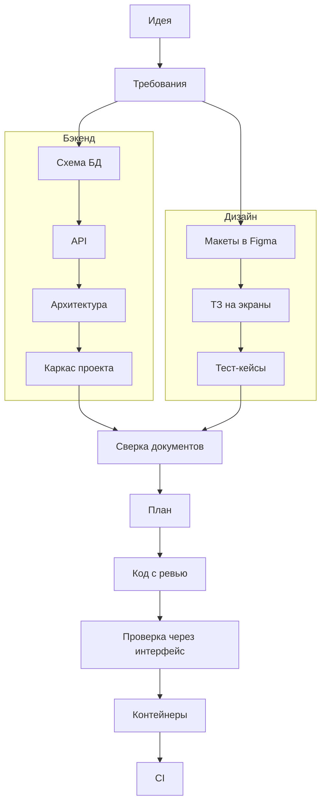

# dev-pipeline — от идеи до работающего сервиса вместе с Claude

> Плагин для Claude Code, который проводит веб-сервис через все этапы разработки: требования, схема
> данных, API, архитектура, макеты в Figma, ТЗ на экраны, тест-кейсы, план, код с ревью, проверка через
> интерфейс, контейнеры и CI. Вы принимаете решения — Claude делает работу и спрашивает на каждом шаге.

Версия плагина: **1.2.43**

---

## Что получится в итоге

- **Комплект документации** — понятный и связанный: требования (SRS), схема базы данных, контракт API,
  архитектура, макеты в Figma, ТЗ на каждый экран, пользовательские тест-кейсы. Всё на русском.
- **Работающий код** — бэкенд и фронтенд, каждый кусок прошёл ревью перед коммитом.
- **Проверка через интерфейс** — Playwright-тесты по тест-кейсам, прогнанные на запущенном приложении.
- **Контейнеры и CI** — docker-compose для тестов, разработки и продакшена; для эксплуатации — папка
  выпуска `release/<версия>/` с архивом образов и инструкцией `DEPLOY.md`; проверки на каждый push в GitHub.

Документация складывается в одну понятную структуру:

```text
documentation/
├── requirements/      требования: бизнес-требования, SRS, пожелания к интерфейсу
├── db/                схема базы данных и миграции
├── api/               контракт API (openapi.yaml)
├── architecture/      архитектура: основа, доменная модель, сценарии по областям
├── ui/                реестр макетов, ТЗ на экраны, тест-кейсы
├── project-map/       карта проекта
├── deploy/            инструкция для эксплуатации (deploy.md)
└── plans/<версия>/    план, прогресс работы, отчёты проверок, итог версии
```

---

## Что нужно подготовить

### 1. Figma — для макетов

Плагин рисует макеты экранов прямо в Figma, а потом пишет по ним ТЗ для фронтенда.

- **Аккаунт Figma с полным доступом (Full) на платном тарифе** (Professional, Organization или Enterprise).
  В платной команде Figma у каждого участника свой тип доступа: Full, Dev, Collab или View (в настройках
  Figma он называется seat). Рисовать макеты через плагин можно только с доступом Full. С Dev макеты можно
  только читать — этого хватит для ТЗ и проверки экранов, но не для рисования. С Collab и View плагин
  сможет обратиться к Figma всего несколько раз в месяц — пайплайн так не пройти. Свой тип доступа можно
  узнать у администратора команды в Figma или после подключения — см. шаг 7 в
  [Как подключить Figma](#как-подключить-figma).
- **Файл в Figma, куда будут рисоваться макеты.** Подойдёт пустой. У вас должны быть права на
  **редактирование** этого файла. Ссылку на файл вы дадите, когда плагин спросит.
- Если в файле уже есть макеты дизайнера, плагин может работать с ними: разметит экраны и не будет
  перерисовывать.

Если у сервиса нет интерфейса (только API), Figma не нужна — дизайн-этапы пропускаются.

### 2. MCP-серверы

MCP-сервер — это «подключение» Claude к внешнему сервису. Плагин приносит два сервера с собой,
отдельно их ставить не нужно:

| Сервер | Зачем | Что сделать |
|---|---|---|
| **Figma** | рисовать макеты, читать их для ТЗ и для проверки экранов | один раз войти в аккаунт — см. [Как подключить Figma](#как-подключить-figma) |
| **Context7** | брать актуальную документацию библиотек, когда пишется код | ничего, работает сразу |

Без входа в Figma этапы с макетами остановятся и попросят подключить Figma.

#### Как подключить Figma

Делается один раз, после [установки плагина](#установка).

1. **Войдите в нужный аккаунт Figma в браузере** (figma.com). Подключится тот аккаунт, который сейчас открыт
   в браузере, — если у вас их несколько, сначала выйдите из лишнего.
2. **Откройте Claude Code** в терминале в любой папке:

   ```bash
   claude
   ```

3. **Выполните в чате команду** `/mcp`:

   ```text
   /mcp
   ```

   Откроется список подключений. Сервер Figma из плагина называется `plugin:dev-pipeline:figma` и
   помечен как требующий входа (`needs authentication`).
4. **Выберите его стрелками, нажмите Enter и выберите Authenticate.** Откроется браузер со страницей Figma.
   Если браузер не открылся, Claude Code покажет ссылку — скопируйте её и откройте вручную.
5. **На странице Figma нажмите Allow access** — так вы разрешаете Claude работать с вашими файлами.
6. **Вернитесь в терминал.** Появится сообщение `Authentication successful. Connected to figma`, а в
   списке `/mcp` у сервера будет статус `connected`. Список закрывается клавишей Esc.
7. **Проверьте вход.** Напишите в чате:

   ```text
   Кто я в Figma?
   ```

   Claude ответит именем аккаунта и типом доступа. Должно быть **Full** — иначе макеты рисоваться не будут.

Вход сохраняется, повторять его при каждом запуске не нужно.

**Если что-то не так:**
- **Подключился не тот аккаунт или Figma снова просит входа** — выполните `/mcp`, выберите
  `plugin:dev-pipeline:figma` и снова выберите Authenticate, предварительно открыв в браузере нужный
  аккаунт.
- **Нет прав на файл** — попросите владельца файла дать вам права на редактирование (Can edit).
- **В списке `/mcp` нет сервера Figma** — плагин не установлен или Claude Code не перезапущен после установки.

### 3. Программы на компьютере

Нужны для схем в документах, локальной базы данных, контейнеров и тестов.

| Программа | Зачем | Когда понадобится |
|---|---|---|
| **Git** | история изменений, каждый шаг — коммит | с первого этапа |
| **D2** | схемы в документах (архитектура, схема БД) | с этапа схемы БД |
| **PlantUML** | диаграммы последовательности для сложных сценариев | на этапе архитектуры |
| **Docker** (Docker Desktop или Docker Engine) | локальная база данных, контейнеры, сборка образов | с каркаса проекта |
| **Node.js 22+** (или Python + uv) | сам сервис; Node.js нужен и для тестов через браузер | с каркаса проекта |
| **Браузер для тестов** (Chromium от Playwright) | проверка готового приложения через интерфейс | на этапе UI-приёмки |
| **GitHub-аккаунт** | только для этапа CI | в конце |

### 4. Установка по шагам

Ставьте по порядку. Каждая команда — отдельно: скопировать, вставить в терминал, дождаться окончания.

#### macOS

**1. Homebrew** — менеджер программ для macOS. Если уже стоит (`brew --version` печатает версию), пропустите.

```bash
/bin/bash -c "$(curl -fsSL https://raw.githubusercontent.com/Homebrew/install/HEAD/install.sh)"
```

В конце установщик покажет две-три команды «Next steps» — выполните их, чтобы `brew` стал доступен.

**2. Git, D2, PlantUML, Node.js:**

```bash
brew install git d2 plantuml node
```

**3. Docker Desktop:**

```bash
brew install --cask docker
```

Откройте Docker Desktop из «Программ» один раз и дождитесь, пока он запустится (значок кита в строке меню).

**4. Python и uv** — только если сервис будет на Python:

```bash
brew install uv
```

**5. Браузер для тестов через интерфейс:**

```bash
npx playwright install chromium
```

#### Linux (Ubuntu, Debian)

Через `apt` ставятся только Git, curl и PlantUML: D2 в стандартных репозиториях нет, а Docker и Node.js там
устаревших версий, поэтому для них — официальные способы установки.

**1. Git, curl, PlantUML:**

```bash
sudo apt update && sudo apt install -y git curl plantuml
```

**2. D2:**

```bash
curl -fsSL https://d2lang.com/install.sh | sh -s --
```

**3. Docker Engine** (вместе с ним ставится buildx для сборки образов):

```bash
curl -fsSL https://get.docker.com | sh
```

Чтобы запускать Docker без `sudo`, добавьте себя в группу `docker`:

```bash
sudo usermod -aG docker $USER
```

Затем выйдите из системы и войдите снова (или перезагрузитесь), чтобы это вступило в силу.

**4. Node.js 22** — через nvm:

```bash
curl -o- https://raw.githubusercontent.com/nvm-sh/nvm/v0.40.8/install.sh | bash
```

Откройте новое окно терминала и поставьте Node.js:

```bash
nvm install 22
```

**5. Python и uv** — только если сервис будет на Python:

```bash
curl -LsSf https://astral.sh/uv/install.sh | sh
```

**6. Браузер для тестов через интерфейс** (вместе с системными библиотеками, которые ему нужны):

```bash
npx playwright install --with-deps chromium
```

На Fedora и Arch вместо шага 1 — `sudo dnf install git curl plantuml` или `sudo pacman -S git curl plantuml`;
остальные шаги те же.

#### Windows (через WSL 2)

Плагин работает в Linux-окружении внутри Windows — WSL 2 с Ubuntu. Все программы ставятся в Ubuntu,
а Docker — как Docker Desktop для Windows, который отдаёт Docker в Ubuntu.

Нужна Windows 11 или Windows 10 версии 2004 и новее (узнать: Win+R → `winver`). В BIOS/UEFI должна быть
включена виртуализация (Intel VT-x или AMD-V) — на большинстве компьютеров она включена; проверить:
Диспетчер задач → Производительность → ЦП → «Виртуализация: Включено».

**1. WSL 2 и Ubuntu.** Откройте PowerShell от имени администратора (Пуск → PowerShell → правой кнопкой →
«Запуск от имени администратора») и выполните:

```powershell
wsl --install
```

Перезагрузите компьютер. После перезагрузки откроется окно Ubuntu (если не открылось — найдите Ubuntu в
меню Пуск). Придумайте имя пользователя и пароль для Linux: они не связаны с учётной записью Windows,
пароль понадобится для команд с `sudo`.

Если WSL уже стоял, обновите его и проверьте, что Ubuntu работает на версии 2:

```powershell
wsl --update
```

```powershell
wsl -l -v
```

В колонке VERSION должно быть `2`. Если там `1`:

```powershell
wsl --set-version Ubuntu 2
```

**2. Docker Desktop для Windows** — ставится в Windows, не в Ubuntu. Скачайте
[Docker Desktop](https://docs.docker.com/desktop/setup/install/windows-install/) или в PowerShell:

```powershell
winget install -e --id Docker.DockerDesktop
```

Запустите Docker Desktop и в его настройках проверьте:
- Settings → General → включено «Use the WSL 2 based engine»;
- Settings → Resources → WSL integration → включён переключатель напротив Ubuntu → Apply & restart.

Docker Desktop должен быть запущен, когда плагин собирает образы или поднимает контейнеры.

Дальше всё — в окне Ubuntu (Пуск → Ubuntu, или вкладка Ubuntu в Windows Terminal).

**3. Git, curl, PlantUML:**

```bash
sudo apt update && sudo apt install -y git curl plantuml
```

**4. D2:**

```bash
curl -fsSL https://d2lang.com/install.sh | sh -s --
```

**5. Node.js 22** — через nvm:

```bash
curl -o- https://raw.githubusercontent.com/nvm-sh/nvm/v0.40.8/install.sh | bash
```

Закройте и снова откройте окно Ubuntu и поставьте Node.js:

```bash
nvm install 22
```

Проверьте, что используется Node.js из Ubuntu, а не из Windows — путь должен начинаться с `/home/`:

```bash
which node
```

**6. Python и uv** — только если сервис будет на Python:

```bash
curl -LsSf https://astral.sh/uv/install.sh | sh
```

**7. Браузер для тестов через интерфейс** (вместе с системными библиотеками, которые ему нужны):

```bash
npx playwright install --with-deps chromium
```

**8. Папка для проектов.** Держите проекты внутри Ubuntu, а не на диске `C:` (`/mnt/c/...`): там работа с
файлами в разы медленнее, и сборка с тестами заметно тормозит.

```bash
mkdir -p ~/projects && cd ~/projects
```

Открыть эту папку в Проводнике Windows можно командой `explorer.exe .`, а в VS Code (с расширением WSL) —
`code .`.

#### Проверка

На Windows — в окне Ubuntu. Каждая команда должна напечатать номер версии:

```bash
git --version
```

```bash
d2 --version
```

```bash
plantuml -version
```

```bash
docker --version
```

```bash
docker buildx version
```

```bash
node --version
```

Если какая-то пишет «command not found» — эта программа не поставилась или терминал нужно открыть заново.

Если D2 или PlantUML не установлены, документы всё равно пишутся, но вместо картинки схемы останется
только её исходный текст — плагин об этом скажет. PlantUML можно заменить Docker'ом: плагин сам
запустит его в контейнере.

---

## Установка

В Claude Code (в чате) выполните две команды:

```text
/plugin marketplace add Idontlikedrinkpivo/web-dev-pipeline-claude-plugin
```

```text
/plugin install dev-pipeline@dev-pipeline-marketplace
```

Или то же самое в терминале:

```bash
claude plugin marketplace add Idontlikedrinkpivo/web-dev-pipeline-claude-plugin
```

```bash
claude plugin install dev-pipeline@dev-pipeline-marketplace
```

Затем:

1. **Перезапустите Claude Code** — так он увидит скиллы и агентов плагина.
2. **Подключите Figma** — по шагам в разделе [Как подключить Figma](#как-подключить-figma).
3. **Проверьте:** откройте любую папку и напишите `/dev-pipeline:pipeline где я`. Плагин ответит, на каком
   этапе проект (в пустой папке — «в начале»).

### Обновление до новой версии

Номер последней версии указан в начале этого README («Версия плагина»). Сами по себе обновления не
приходят — их нужно скачать.

Команды ниже вводятся не в чат Claude, а в обычный терминал: на macOS — программа «Терминал»
(Программы → Утилиты), на Linux — любой терминал, на Windows — окно Ubuntu. Каждую команду вставьте,
нажмите Enter и дождитесь окончания.

1. **Узнайте, какая версия стоит у вас** — строка `Version`:

   ```bash
   claude plugin list
   ```

2. **Обновите список версий из этого репозитория:**

   ```bash
   claude plugin marketplace update dev-pipeline-marketplace
   ```

3. **Обновите плагин:**

   ```bash
   claude plugin update dev-pipeline@dev-pipeline-marketplace
   ```

4. **Перезапустите Claude Code** — закройте и снова откройте приложение Claude или выйдите из `claude` в
   терминале и запустите его заново. Уже открытые сессии продолжают работать на старой версии.
5. **Проверьте:** `claude plugin list` показывает новую версию.

Документы и код ваших проектов при обновлении не меняются, вход в Figma сохраняется. Если проект был
на середине этапа, напишите `/dev-pipeline:pipeline где я` — плагин найдёт, где вы остановились, и
продолжит уже по правилам новой версии.

---

## Быстрый старт: первый проект

1. Создайте пустую папку для проекта и откройте её в Claude Code.
2. Опишите идею. Подходит любой формат — пара абзацев, заметка, тикет, письмо заказчика:

   ```text
   /dev-pipeline:brainstorm Хочу сервис бронирования переговорных для коворкинга.
   Резиденты бронируют комнату на время, администратор закрывает комнату на обслуживание.
   ```

   Если требования уже понятны и записаны, начните сразу с SRS:

   ```text
   /dev-pipeline:srs-writer <ваше описание или путь к файлу с ним>
   ```

3. Отвечайте на вопросы. Claude задаёт их по одному и предлагает варианты с рекомендацией. Ответ — обычное
   сообщение: буква варианта или свой текст.
4. После каждого этапа Claude показывает результат и спрашивает, что дальше: **запустить** следующий этап,
   **пропустить** проверку или **остановиться**. Можно остановиться в любой момент и вернуться позже.
5. В новой сессии напишите `/dev-pipeline:pipeline где я` — плагин по файлам на диске поймёт, где вы
   остановились, и предложит следующий шаг.

---

## Как устроен процесс

После требований работа идёт двумя параллельными ветками — бэкенд и дизайн — и они встречаются перед
планом:



| Этап | Скилл | Что происходит | Проверка после этапа | Что делаете вы | Что появляется |
|---|---|---|---|---|---|
| Идея | `brainstorm` | разбираем идею: цель, пользователи, границы | допрос `grill-me` | отвечаете на вопросы | бизнес-требования |
| Требования | `srs-writer` | пишет SRS: требования, сценарии, правила, критерии приёмки | допрос `grill-me` → ревью `doc-review` | отвечаете, принимаете | `requirements/srs/srs.md` |
| Схема БД | `db-schema-design` | проектирует таблицы и первую миграцию | ревью `doc-review` | смотрите, задаёте вопросы | `db/schema.md`, `db/migrations/` |
| API | `openapi-spec-generator` | описывает контракт API | ревью `doc-review` | — | `api/openapi.yaml` |
| Архитектура | `clean-architecture-design` | основа, доменная модель, сценарии; предлагает стек | ревью `doc-review` каждого документа | выбираете стек из вариантов | `architecture/` |
| Каркас | `repo-scaffold` | создаёт пустой запускаемый проект по архитектуре | — | — | код каркаса, карта проекта |
| Макеты | `ui-design` | рисует экраны в Figma по требованиям | — (макеты смотрите вы сами) | даёте ссылку на файл Figma, смотрите макеты | макеты, `ui/frames-register.md` |
| ТЗ на экраны | `screen-spec` | ТЗ на фронтенд по каждому экрану | ревью `doc-review` | — | `ui/screen-specs/` |
| Тест-кейсы | `ui-test-cases` | пользовательские сценарии проверки | — | — | `ui/test-cases.md` |
| Сверка | `docs-consistency` | проверяет, что все документы согласованы | — (этап сам проверка) | решаете спорные места | отчёт в папке версии |
| План | `plan` | разбивает работу на небольшие задачи | ревью плана `plan-review` | подтверждаете версию | `plans/<версия>/plan.md` |
| Код | `work` | выполняет план | ревью каждой задачи `code-review-unit`, в конце ревью всего результата `code-review-full` — запускаются сами | следите за прогрессом | код, `progress.md` |
| Проверка | `ui-test-cases` | прогоняет тест-кейсы в браузере | — (этап сам проверка) | смотрите отчёт | отчёт о дефектах |
| Контейнеры | `deploy-topology` | docker-compose, образы и инструкция для эксплуатации | — | — | `release/<версия>/`: архив образов и `DEPLOY.md` |
| CI | `ci-pipeline` | проверки на каждый push в GitHub | — | — | `.github/workflows/ci.yml` |

Нет интерфейса — дизайн-ветка пропускается. Нет базы данных — пропускается схема. Плагин сам скажет, что и
почему пропущено.

### Проверки между этапами

Где какая проверка — в колонке «Проверка после этапа». Перед каждой (кроме ревью кода) Claude спрашивает:
запустить, пропустить или остановиться.

- **Допрос** (`grill-me`) — Claude задаёт неудобные вопросы по требованиям, чтобы не осталось молчаливых
  допущений. Лучше не пропускать на первой версии.
- **Ревью документа** (`doc-review`) — несколько «рецензентов» с разных сторон (логика, безопасность,
  выполнимость) ищут пробелы; очевидное исправляют сами, спорное спрашивают у вас.
- **Сверка комплекта** (`docs-consistency`) — все документы вместе: у каждого требования есть место в
  документах, одно и то же везде называется одинаково.
- **Ревью плана** (`plan-review`) — задачи действительно маленькие, порядок верный, каждый критерий приёмки
  чем-то покрыт.
- **Ревью кода** (`code-review-unit`, `code-review-full`) — каждой задачи сразу после неё и всего результата
  в конце; идёт автоматически, без вопроса.

Пропуск проверки — нормальный выбор для маленького изменения; плагин сам порекомендует, когда можно пропустить.

### Следить за работой

Пока выполняется план, плагин ведёт файл прогресса `documentation/plans/<версия>/progress.md` рядом с
планом. В нём каждая задача: что делает, какой агент её выполняет, статус и итог ревью. Строка меняется
сразу, как только меняется статус задачи, а в чате после каждой задачи Claude пишет «План: N из M».

**Как открыть:** перед первой задачей Claude выводит в чат ссылку на `progress.md` — нажмите на неё, файл
откроется в панели рядом с чатом и будет обновляться по ходу работы.

**Как это выглядит:**

> **Прогресс: documentation/plans/1.1.0/plan.md**
>
> BASE: `a1b2c3d` · Сделано: 3 из 6 · Обновлено: 2026-10-05 14:32
>
> | U | Цель | Исполнитель | Статус | Ревью |
> |---|---|---|---|---|
> | U1 | миграция: таблица отмен брони | impl-lite | ✅ закоммичен | COMMIT |
> | U2 | сущность «Бронь»: правило отмены не позже чем за час | impl-medium | ✅ закоммичен | FIX_THEN_COMMIT (текст ошибки) → исправлено |
> | U3 | сценарий «Отменить бронь» | impl-medium | ✅ закоммичен | COMMIT |
> | U4 | API: POST /bookings/{id}/cancel | impl-medium | 🔍 на ревью | — |
> | U5 | экран S-2: кнопка «Отменить» и диалог подтверждения | impl-ui | 🔄 в работе | — |
> | U6 | версия сервиса 1.1.0 | mechanical-worker | ⏳ ждёт | — |
>
> Финальное ревью: не запускалось

Статусы: `⏳ ждёт` → `🔄 в работе` → `🔍 на ревью` → `✅ закоммичен`; `⛔ остановлен` — задача не
получилась, плагин объясняет причину и спрашивает, что делать. В колонке «Ревью» — путь задачи через
ревью: `COMMIT` — принята с первого раза, `FIX_THEN_COMMIT (…) → исправлено` — были мелкие замечания.

Если финальное ревью всего результата нашло проблемы, ниже появляется раздел «Исправления по финальному
ревью»: каждое замечание — отдельной строкой со своим статусом, а в конце — итог повторного ревью.

---

## Доработка существующего проекта

Когда сервис уже есть, новая фича идёт тем же путём, но документы не пишутся заново — правятся на месте.
Начинайте с идеи, как и в первый раз:

```text
/dev-pipeline:brainstorm Добавить отмену брони: резидент может отменить свою бронь не позже чем за час.
```

`brainstorm` дополнит существующие бизнес-требования (новые пункты получают следующие свободные номера)
и уточнит то, что в идее не сказано: кто ещё может отменять, что происходит с отменённой бронью, кого
уведомить. Если идея уже описана точно — с критериями приёмки и границами, — он сам это заметит,
обойдётся парой вопросов и предложит перейти к требованиям.

Когда изменение маленькое и уже сформулировано как требование, можно сразу начать с `srs-writer`:

```text
/dev-pipeline:srs-writer Срок отмены брони меняется с часа на 30 минут.
```

Дальше плагин ведёт по тем же этапам и затрагивает только то, что меняется: каждое изменение в документе
помечается как «ломает», «добавляет» или «уточняет», и следующие этапы предлагаются только для тех
документов, которых оно касается.

### Версии

У сервиса один номер версии вида `1.4.2`:

| Часть | Когда растёт |
|---|---|
| **первая** (1.x.x) | крупная новая возможность — решаете вы |
| **вторая** (x.4.x) | новая функциональность |
| **третья** (x.x.2) | только исправления |

До первого выпуска версии начинаются с `0.` (первая работа — `0.1.0`). У каждой версии своя папка
`plans/<версия>/`, а в конце ставится метка в git — снимок всей документации и кода этой версии.

У каждого документа в начале есть журнал изменений: что поменялось, в какой версии и как —
**ломает** (нужно переделать зависимое), **добавляет** (новое) или **уточняет** (та же суть другими словами).

---

## Все скиллы

В плагине 32 скилла. Сами вы обычно вызываете только `brainstorm` (или `srs-writer`) в начале и `pipeline`,
чтобы узнать, где вы; дальше плагин сам предлагает следующий этап. Любой этап можно запустить и напрямую.
Скиллы с пометкой «подключает плагин» вызывать не нужно — их читают этапы и агенты, когда это нужно.

**Этапы процесса**

| Скилл | Что делает | Как вызывается |
|---|---|---|
| `/dev-pipeline:pipeline` | показывает, где вы и что дальше, в любой момент и в новой сессии; закрывает версию | вы |
| `/dev-pipeline:brainstorm` | разбирает сырую идею и пишет бизнес-требования | вы |
| `/dev-pipeline:srs-writer` | пишет или дополняет требования (SRS) | вы или плагин |
| `/dev-pipeline:db-schema-design` | схема базы данных и SQL-миграции | плагин предлагает |
| `/dev-pipeline:openapi-spec-generator` | контракт API (OpenAPI) | плагин предлагает |
| `/dev-pipeline:clean-architecture-design` | архитектура: основа, доменная модель, сценарии по областям | плагин предлагает |
| `/dev-pipeline:repo-scaffold` | пустой запускаемый проект по архитектуре, карта проекта | плагин предлагает |
| `/dev-pipeline:ui-design` | макеты экранов в Figma | плагин предлагает |
| `/dev-pipeline:screen-spec` | ТЗ на фронтенд по каждому экрану | плагин предлагает |
| `/dev-pipeline:ui-test-cases` | пишет тест-кейсы (write) и прогоняет их в браузере (run) | плагин предлагает |
| `/dev-pipeline:docs-consistency` | сверяет все документы между собой | плагин предлагает |
| `/dev-pipeline:plan` | план реализации небольшими задачами | плагин предлагает |
| `/dev-pipeline:work` | выполняет план: каждая задача — отдельный агент, ревью и коммит | плагин предлагает |
| `/dev-pipeline:deploy-topology` | docker-compose для окружений, сборка образов в tar и инструкция `DEPLOY.md` для эксплуатации | плагин предлагает |
| `/dev-pipeline:ci-pipeline` | CI в GitHub Actions | плагин предлагает |

**Проверки**

| Скилл | Что делает | Как вызывается |
|---|---|---|
| `/dev-pipeline:grill-me` | допрос документа: неудобные вопросы, чтобы не осталось молчаливых допущений | плагин предлагает; можно и вам |
| `/dev-pipeline:doc-review` | ревью одного документа несколькими рецензентами | плагин предлагает; можно и вам |
| `/dev-pipeline:plan-review` | ревью плана: размер задач, порядок, покрытие критериев приёмки | плагин предлагает; можно и вам |
| `/dev-pipeline:code-review-unit` | ревью кода одной задачи перед коммитом | подключает `work` |
| `/dev-pipeline:code-review-full` | ревью всего результата после последней задачи | подключает `work` |

**Служебные**

| Скилл | Что делает | Как вызывается |
|---|---|---|
| `/dev-pipeline:doc-versioning` | версии документов, журнал изменений, поиск устаревших ссылок | плагин; можно и вам |
| `/dev-pipeline:executor-catalog` | какая модель и какой агент делает какую работу | подключает плагин |
| `/dev-pipeline:ux-patterns` | проверяемые правила удобства интерфейса для макетов и экранов | подключает плагин |

**Правила для кода по технологиям** — их читают агенты, которые пишут и проверяют код

| Скилл | Что делает | Как вызывается |
|---|---|---|
| `/dev-pipeline:typescript-fastify` | HTTP-слой на Fastify по контракту API | подключает плагин |
| `/dev-pipeline:typescript-drizzle-orm` | работа с базой через Drizzle ORM, применение миграций | подключает плагин |
| `/dev-pipeline:zod-skill` | проверка входных данных через Zod | подключает плагин |
| `/dev-pipeline:vitest` | тесты на Vitest по слоям архитектуры | подключает плагин |
| `/dev-pipeline:fastapi` | HTTP-слой на FastAPI по контракту API | подключает плагин |
| `/dev-pipeline:fastapi-sqlalchemy` | работа с базой через SQLAlchemy и Alembic | подключает плагин |
| `/dev-pipeline:pytest-patterns` | тесты на pytest по слоям архитектуры | подключает плагин |
| `/dev-pipeline:frontend` | экраны по ТЗ и контракту API (React + Vite или Next.js) | подключает плагин |
| `/dev-pipeline:playwright-cli` | управление браузером и тесты Playwright | подключает плагин |

---

## Ограничения

- **Стек:** бэкенд на TypeScript (Fastify, Drizzle, Zod, Vitest) или Python (FastAPI, SQLAlchemy, pytest),
  база PostgreSQL, фронтенд на React + Vite или Next.js. Другие технологии — только если они уже есть в
  проекте.

---

## Лицензия

[MIT](LICENSE) — можно свободно использовать, менять и распространять, сохраняя упоминание автора.
