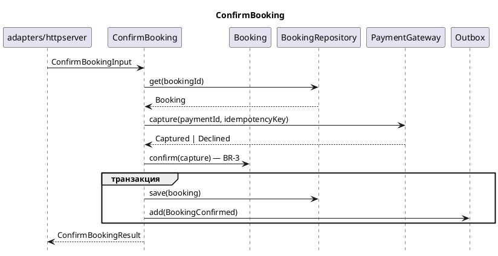

# Architecture diagrams — D2 views and PlantUML sequences

`clean-architecture-design` draws two kinds of picture. The
**foundation views** (D2) (Контекст, Контейнеры, Слои, Хранилища и
интеграции, Модули) project layers, stores, and externals of the
foundation document (`architecture.md`); the foundation stays the
contract, and the views are how a human edits topology without wading
through §4–§5. Each view is embedded in the foundation section it
illustrates. The **sequence view** shows one key scenario of a scenarios
document, step by step, in PlantUML (see Sequence view below).

## Path

Diagrams live in a `diagrams/` folder next to the document that shows
them:

```
documentation/architecture/architecture.md                foundation; embeds each view
documentation/architecture/diagrams/context.d2 / .svg
documentation/architecture/diagrams/containers.d2 / .svg  more than one process only
documentation/architecture/diagrams/stores.d2 / .svg
documentation/architecture/diagrams/modules.d2 / .svg     two or more areas only
documentation/architecture/diagrams/layers.d2 / .svg
documentation/architecture/scenarios/<area>/<area>.md
documentation/architecture/scenarios/<area>/diagrams/<use-case-kebab>.puml / .svg   key scenarios only
```

There is no diagram index file: the document that shows a picture links
it, so the picture moves with the text it projects. A view is embedded
in its foundation section (Embeds below); a sequence view is linked from
its scenario's «Последовательность» row. A `diagrams/` folder exists only
when it holds a file. Never a dated extra file. No `version`, no
changelog on a `.d2` or a `.puml`: they change with the document that
shows them, and its changelog carries the change.

## Why D2, embedded

Each view is a `.d2` file. `d2` renders it to `.svg`, and the foundation
embeds the SVG (``) inside the section
whose tables it projects, so the reader sees the picture beside the rows
it draws — Markdown preview and GitHub show it alike. A separate index
page sent the reader away from the table to find the picture, and let
the two drift unnoticed. A human edits the `.d2` and re-renders. An
agent reads and writes the same source. Do not emit Mermaid, PNG,
draw.io, or Excalidraw.

## Embeds in the foundation

Each view sits in the section whose rows it draws. The embed is one
Markdown image line, alt text = the view's name, path relative to
`architecture.md`:

| View | File | Section of `architecture.md` | Embed |
|---|---|---|---|
| Контекст | `diagrams/context.d2` | §1 Состав системы, right under the heading, before the tables | `` |
| Контейнеры | `diagrams/containers.d2` | §1, right under Контекст | `` |
| Хранилища и интеграции | `diagrams/stores.d2` | §1 «Хранилища», under its table | `` |
| Модули | `diagrams/modules.d2` | §2, under the areas table | `` |
| Слои | `diagrams/layers.d2` | §3, under the layer roster | `` |

Контекст, Хранилища and Слои are always drawn. A skipped view is one
sentence in its section, in place of the embed, and no `.d2`:
**Контейнеры** when the system is a single process («Один процесс —
`<name>`; схемы контейнеров нет.»), **Модули** when there is one area
(«Одна область; схемы модулей нет.»). Finished shape:
`architecture-diagram.example.md`.

## Render

After every `.d2` write, render the sibling `.svg`, from
`documentation/architecture/diagrams/`. Layout is declared in the file
(`layout-engine: elk`), not only on the command line.

```bash
D2="${D2:-$HOME/.local/bin/d2}"
if [ ! -x "$D2" ]; then D2="$(command -v d2 || true)"; fi
"$D2" "context.d2" "context.svg"
```

Repeat for each view. If `d2` is not installed, still write every
`.d2` and every embed. Say in the stage close that the SVG was not
rendered and name `~/.local/bin/d2`. Do not invent an SVG. The
orchestrator runs this same command once for any `.d2` whose `.svg` is
missing. It does not edit the `.d2`.

## What the diagram is allowed to show

Foundation views show only tokens the foundation already named, or
tokens the user just added on a `.d2` and asked to apply:

| Node kind | Comes from | Shown as |
|---|---|---|
| This system | architecture H1 | one box |
| Actors | §1 | `person` on the left |
| External systems | §1 | boxes on the right |
| Database / file / object store | §1 Хранилища — **not** tables | `cylinder` or `stored_data` |
| Layers / areas | §5 (`domain`, `application`, `adapters/…`, `bootstrap`); areas from §2 | containers |
| Ports | §4 type names | nodes inside `application` |
| Use cases | one node per area, «сценарии <area>» — names live in the scenarios documents | node inside `application` |
| Adapters | §4 | nodes inside the matching `adapters/…` container |
| Composition root | §4 Сборка / §5 `bootstrap` | one container |

Do not draw an ER diagram. Tables belong to `db-schema-design`. Inside
«Слои», ports are either every name from §4, or one node that states
the count («9 портов»); a partial list with no count is a defect. Use
cases are one node per area, never names, so a new use case does not
redraw the foundation. «Модули» exists only when §2 names two or more
areas; otherwise §2 says so in one sentence and there is no file.

## File shape

Every foundation `.d2` starts with this header. Labels are the exact
token of the document. A label the document cannot resolve is a sync
defect.

```
vars: {
  d2-config: {
    layout-engine: elk
  }
}
direction: right
```

A human edits the `.d2` without the architecture open, so the picture has
to explain its own lines. Every edge in Контекст and Контейнеры has a
label: the protocol or the verb (`"HTTPS"`, `"SQL"`, `"вызывает API"`). A
container label carries its §1 Стек technology: `be: "backend (NestJS)"`.
«Слои» ends with a legend; the legend is the one block exempt from token
resolution:

```
legend: "Легенда" {
  a -> b: "импорт"
  c -> d: "реализует порт" {style.stroke-dash: 4}
}
```

### Контекст

```
actor: Operator {shape: person}
sys: IndoorNav
db: postgres {shape: cylinder}
files: "svg-store" {shape: stored_data}
ext: osm
actor -> sys: "HTTPS"
sys -> db: "SQL"
sys -> files: "S3 API"
sys -> ext: "HTTPS, тайлы"
```

### Контейнеры

Processes that talk over the network — not layers inside one backend.

```
fe: "frontend (React)"
be: "backend (NestJS)"
db: "postgres (16)" {shape: cylinder}
fe -> be: "HTTPS"
be -> db: "SQL"
```

### Слои

Solid edges are imports, inward only. A dashed edge means an adapter
implements a port. The legend block says the same inside the picture.

```
direction: down
adapters: "adapters/" {
  http: HttpServer
  persist: VenueRepository
}
application: "application/" {
  uc: "сценарии venues"
  portR: VenueRepository
}
domain: "domain/" {
  ent: Venue
}
adapters.http -> application.uc
application.uc -> domain.ent
adapters.persist -> application.portR: {style.stroke-dash: 4}
legend: "Легенда" {
  a -> b: "импорт"
  c -> d: "реализует порт" {style.stroke-dash: 4}
}
```

### Хранилища и интеграции

```
persist: VenueRepository
db: postgres {shape: cylinder}
persist -> db: "SQL"
```

Do not draw a domain entity talking to Postgres.

### Модули

One container per §2 area. An edge only when §2 says one area calls
another. No edge means no call.

```
direction: right
booking: booking {
  domain: domain
  application: application
}
catalog: catalog {
  domain: domain
}
booking -> catalog: "читает каталог"
```

## Sequence view (key scenarios) — PlantUML

Sequence diagrams are PlantUML, not D2: it is the notation the team reads
and edits for sequences. The foundation views above stay D2.

Only for a **key scenario** of a scenarios document — three or more
ports or external calls, parallel calls, a transaction spanning an
external call, retries or idempotency, a long-running operation
(`output-template-scenarios.md`). A plain read-and-return or
load-ask-save scenario gets none: its Шаги table already says
everything.

File: `scenarios/<area>/diagrams/<use-case-kebab>.puml` and its `.svg`,
next to the area's document; `<use-case-kebab>` is the use case name in
kebab-case (`ConfirmBooking` → `confirm-booking`). The use case's
«Последовательность» row links it:
`[confirm-booking](diagrams/confirm-booking.svg)`. One
`@startuml … @enduml` per file, `title` = the use case name,
`hide footbox`.

What it may show, and nothing else:

- participants, left to right: the inbound adapter, the use case, each
  entity it asks, each port it calls (named as in foundation §4), each
  external system behind a gateway — `participant "<name>" as <alias>`;
- one message per row of the Шаги table, labelled with the same port or
  entity method, a rule id where the step cites one; a reply is a dashed
  arrow (`-->`) labelled with the returned type;
- the transaction boundary as `group транзакция … end`; parallel calls as
  `par параллельно … else … end`; a retry as `loop повтор … end`; a
  branch the Шаги table names as `alt … else … end`;
- the return to the adapter with the `Result` type. No HTTP status, no
  SQL, no adapter internals, no `skinparam` colours.



Render after every `.puml` write, from the diagram's folder
(`scenarios/<area>/diagrams/`):

```bash
if command -v plantuml >/dev/null; then
  plantuml -tsvg "<use-case-kebab>.puml"
elif docker info >/dev/null 2>&1; then
  docker run --rm -v "$PWD":/data -w /data plantuml/plantuml:1.2026.8 -tsvg "<use-case-kebab>.puml"
else
  echo "svg: missing — install PlantUML (brew install plantuml) or start Docker"
fi
```

Neither available: keep the `.puml`, report `svg: missing`, never invent
an SVG. The scenario's Шаги table is the contract; when the two disagree,
the table wins unless the user says the `.puml` is newer — then the
scenarios writer applies the diagram to the table, as below.

## Sync

Two directions. Never both in the same pass without saying which won.
The source of a human edit is the `.d2` (or the `.puml` of a sequence
view). The `.svg` is regenerated and never hand-edited.

### Architecture → diagram (default)

After the foundation is written or edited, rebuild every foundation
`.d2` (and its `.svg`) from §1, §2, §4, and §5, and check each embed
still sits in its section. A view that becomes due (a second process, a
second area) gains its files and its embed in place of the skip
sentence; one that stops being due loses both files and gets the
sentence back. After a scenarios document is written or edited, rebuild
the sequence view of every key scenario whose steps changed; a scenario
that stops being key loses its `diagrams/<use-case-kebab>.puml` / `.svg`
and its «Последовательность» row, and an empty `diagrams/` folder goes
with them. Do not invent boxes the document does not name.

### Diagram → architecture (when the user edited the scheme)

Trigger: the user said they changed the diagram, or «внеси правки из
схемы», or an increment finds a `.d2` or `.puml` disagrees with §1 / §2 / §4 / §5
**and** the user confirms the diagram is newer. A foundation view
applies to the foundation; a sequence view applies to its scenario's
Шаги table and goes through a `scenarios:<area>` dispatch.

Then, token by token:

| Diagram change | Architecture move |
|---|---|
| new external / store box | add to §1; add a port + adapter in §4 if a talk-path exists; Open Question if no requirement names it |
| removed external / store | stop and ask if a cited token; otherwise drop from §1 / §4 |
| new adapter or port | add signatures in §4 and a file in §5; do not invent entity rules |
| removed adapter or port | same as a deprecated cited token — ask if something still cites it (a scenario step, too) |
| renamed quoted token | rename that token in §1 / §4 / §5, and report the scenarios documents that cite it; this is a contract move when increment versioning is on |
| new layer / area box | add the folder in §5 (and an area row in §2) only if the current level allows it; do not promote Modest → Full silently |
| new edge | update §4 wiring; a changed write is a scenarios change, not this one; do not add a use case the SRS does not have |
| removed edge | drop that talk-path from §4; ask if an invariant still needs it |
| sequence view: new, removed, or reordered message | the matching row of the scenario's Шаги table; a new port method is added to foundation §4, a new rule to the domain model's invariant table (Writer → `ALSO CHANGED`) |

After applying, regenerate the `.d2` and `.svg` from the updated
document so the files match. Do not leave a hand-edited `.d2` that
names a token the document no longer has.

The diagram cannot decide product behavior, auth, or an invariant. A
new box with no upstream requirement is an Open Question, not a silent
rule.

## Editing

Humans: change the `.d2` (a sequence view: the `.puml`), re-render, say
«внеси в архитектуру» (or «внеси в сценарии» for a sequence view).
Agents: same files, same tokens. Do not pretty-print the architecture
prose to match a layout tweak that added no token and no edge.
